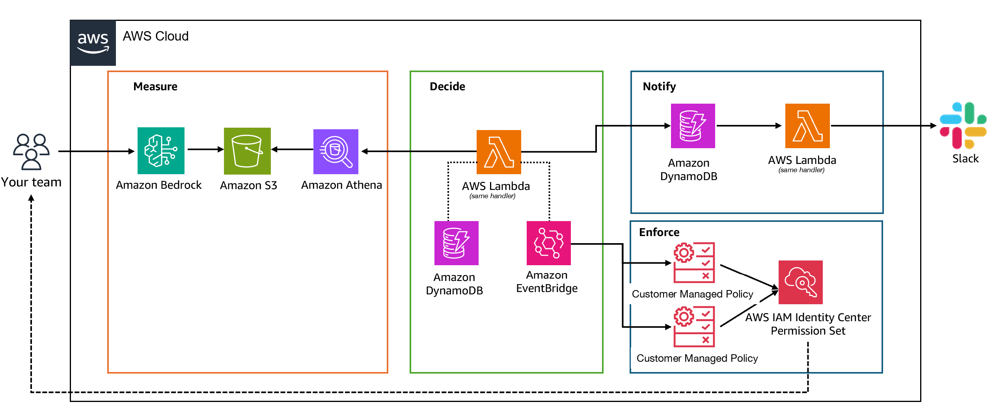

# Bedrock Spend Enforcement

Tiered, real-time spend enforcement for Amazon Bedrock. This sample deploys a
serverless pipeline that measures per-user Bedrock spend from your model
invocation logs, and automatically restricts access to higher-cost models —
via IAM Customer Managed Policies (CMPs) — as each user approaches a daily
budget. It's a companion to the AWS blog post *"Tokenomics at scale: How
Jamf built real-time spend enforcement for Amazon Bedrock."*

Without spend controls, a single runaway script or an unusually chatty user
can turn Bedrock's pay-per-token pricing into an unbounded bill. Rather than
a single hard on/off switch, this sample enforces graduated tiers: Claude
Opus is withdrawn first, Sonnet follows only at the hard limit, and Haiku —
the cheapest model — is never blocked, so a capped user always has a
working fallback. All enforcement decisions and notifications run from one
Lambda function on a 15-minute schedule; a companion Slack app lets admins
inspect spend and grant time-boxed exceptions.

This is a simplified, single-account reference implementation, not the exact
production system described in the blog post — see
[Differences from production](#differences-from-production) below.

## Architecture



The system follows a **Measure → Decide → Enforce → Notify** loop, run every
15 minutes by an EventBridge schedule:

1. **Measure** — Amazon Bedrock model invocation logging writes JSON
   invocation records (model ID, token counts, caller identity — no prompt
   or completion content) to an S3 bucket you control. A Glue table
   projects that S3 layout as a queryable schema, and an Athena view
   (`default.bedrock_cost_today`) aggregates it into per-user, per-model
   token counts and an estimated dollar cost for a rolling ~24-hour window.
2. **Decide** — The enforcement Lambda queries that view, sums each human
   user's spend for the current window, and compares it against that user's
   daily budget (a shared default, or a per-user override recorded in
   DynamoDB). Crossing 80% of the budget calls for denying Claude Opus;
   crossing 100% calls for denying Opus *and* Sonnet. Claude Haiku is never
   denied.
3. **Enforce** — The Lambda rewrites two shared IAM Customer Managed
   Policies — one that denies Opus to the current over-80% user list, one
   that denies Sonnet to the current over-100% user list — by publishing a
   new policy version. Because both policies are attached once to the
   relevant IAM Identity Center permission set, no per-user IAM object
   needs to be created or torn down; only the two shared policy *documents*
   change.
4. **Notify** — The same Lambda run sends a Slack DM the first time a user
   crosses 70% (warning), 80% (Opus withdrawn), or 100% (Opus and Sonnet
   withdrawn) of their budget. A companion Slack slash-command Lambda lets
   any user check their own spend, and lets admins grant temporary manual
   blocks or custom limits without waiting for the next scheduled run.

Budgets reset daily at 04:00 UTC, matching the Athena view's rolling window.

## Prerequisites

Before deploying, you need:

- An AWS account with permissions to create IAM roles/policies, Lambda
  functions, DynamoDB tables, S3 buckets, Glue tables, Athena workgroup
  resources, EventBridge rules, CloudWatch alarms, and (for the Slack slash
  commands) API Gateway HTTP APIs.
- **Amazon Bedrock model invocation logging** already enabled in this
  account, delivering to an S3 bucket you own. This sample expects logs
  under `s3://<your-logs-bucket>/BedrockMetadataClean/AWSLogs/<account-id>/BedrockModelInvocationLogs/<region>/...`
  — the standard layout Bedrock uses when you configure invocation logging
  to S3 with the `BedrockMetadataClean` prefix. See the
  [Bedrock model invocation logging documentation](https://docs.aws.amazon.com/bedrock/latest/userguide/model-invocation-logging.html)
  if you haven't set this up yet.
- **Two IAM Customer Managed Policies created ahead of the Lambda stack**,
  named exactly `BedrockEnforcement-T1` (Opus deny) and
  `BedrockEnforcement-T2` (Sonnet deny), attached to whatever IAM Identity
  Center permission set (or IAM role/group) your Bedrock users assume. The
  enforcement Lambda's IAM role is scoped to write only these two ARNs — it
  does not create them for you. Start both as an empty allow-all statement
  (or a `Deny` with an empty principal condition) so the first Lambda run
  has something to version.
- The AWS CLI, configured with credentials for the single account you're
  deploying into.
- A Slack app (if you want notifications and slash commands) with:
  - A bot token (`xoxb-...`) with `chat:write` and `users:read.email` scopes.
  - A signing secret, for verifying slash-command and interactivity
    requests.
  - Slash commands `/bedrock-spend`, `/bedrock-block`, `/bedrock-unblock`,
    and `/bedrock-limit` configured, plus Interactivity enabled — Request
    URLs for all of these come from the `slash-command` stack's outputs
    (deployed last, see below).

Everything in this sample deploys into **one AWS account** — there is no
cross-account role assumption anywhere in this stack.

## Lambda packaging

Both Lambda functions (`EnforcementLambda` in `lambda.yaml` and
`SlashCommandLambda` in `slash-command.yaml`) share one deployment
package, because `handler.py` and `slash_command.py` both
`import notifier` at runtime. `boto3`/`botocore` already ship in the
Lambda Python 3.12 runtime, so they don't need to be bundled — but
`slack-sdk` does not, so it must be installed into the package.

From the repo root:

```bash
pip install slack-sdk==3.43.0 -t build/
cp lambda/handler.py lambda/notifier.py lambda/slash_command.py build/
cd build && zip -r ../lambda.zip . && cd ..
aws s3 cp lambda.zip s3://<your-lambda-code-bucket>/<your-lambda-zip-key>
```

(`lambda/requirements.txt` also lists `cfn-lint`, `pytest`, and
`pytest-cov` — those are development/test tooling only; installing them
into `build/` would bloat the deployment package without the Lambda ever
using them, so the command above installs only the one runtime dependency
that's missing from the Lambda runtime.)

Both `lambda.yaml` and `slash-command.yaml` take the resulting S3
location as their `LambdaCodeBucket` / `LambdaZipKey` parameters — upload
once, then pass the same bucket and key to both stacks.

## Deploying

Deploy the four stacks in this order — each later stack consumes an output
of an earlier one:

### 1. `infra/dynamodb.yaml` — state and exceptions tables

No parameters.

```bash
aws cloudformation deploy \
  --stack-name bedrock-spend-enforcement-dynamodb \
  --template-file infra/dynamodb.yaml
```

Note the `StateTableArn` and `ExceptionsTableArn` outputs — every later
stack needs both.

```bash
aws cloudformation describe-stacks \
  --stack-name bedrock-spend-enforcement-dynamodb \
  --query 'Stacks[0].Outputs'
```

### 2. `infra/lambda.yaml` — enforcement Lambda, EventBridge trigger, Athena-results bucket

Package the Lambda zip (see above) and upload it before this step.

Parameters:

| Parameter | Value |
|---|---|
| `LambdaCodeBucket` | S3 bucket holding `lambda.zip` |
| `LambdaZipKey` | S3 key of `lambda.zip` |
| `StateDynamoTableArn` | `StateTableArn` output from step 1 |
| `ExceptionsDynamoTableArn` | `ExceptionsTableArn` output from step 1 |
| `LogsBucket` | The S3 bucket your Bedrock invocation logs land in (Prerequisites) |
| `AlarmEmail` *(optional)* | Email to notify on the policy-size alarm; leave empty to skip the subscription |
| `SlackBotToken` *(optional)* | Slack bot token; leave empty to disable spend-threshold DMs |
| `SlackEmailDomain` *(optional)* | Corporate email domain for resolving usernames to Slack IDs; required if `SlackBotToken` is set, otherwise leave empty — see [Slack notes](#slack-slash-commands-and-notifications) |

```bash
aws cloudformation deploy \
  --stack-name bedrock-spend-enforcement-lambda \
  --template-file infra/lambda.yaml \
  --capabilities CAPABILITY_NAMED_IAM \
  --parameter-overrides \
    LambdaCodeBucket=<your-lambda-code-bucket> \
    LambdaZipKey=<your-lambda-zip-key> \
    StateDynamoTableArn=<StateTableArn from step 1> \
    ExceptionsDynamoTableArn=<ExceptionsTableArn from step 1> \
    LogsBucket=<your-bedrock-logs-bucket> \
    AlarmEmail=<your-email@example.com> \
    SlackBotToken=<xoxb-...> \
    SlackEmailDomain=<yourcompany.com>
```

This stack creates the Athena-results bucket
(`bedrock-spend-enforcement-athena-results-<account-id>`) as one of its
resources. Note the `AthenaResultsBucketName` output — the next stack
needs it.

```bash
aws cloudformation describe-stacks \
  --stack-name bedrock-spend-enforcement-lambda \
  --query 'Stacks[0].Outputs'
```

### 3. `infra/athena.yaml` — Glue table and cost view

Parameters:

| Parameter | Value |
|---|---|
| `AthenaResultsBucket` | `AthenaResultsBucketName` output from step 2 |
| `LogsBucket` | The same Bedrock logs bucket passed to step 2 |

```bash
aws cloudformation deploy \
  --stack-name bedrock-spend-enforcement-athena \
  --template-file infra/athena.yaml \
  --capabilities CAPABILITY_NAMED_IAM \
  --parameter-overrides \
    AthenaResultsBucket=<AthenaResultsBucketName from step 2> \
    LogsBucket=<your-bedrock-logs-bucket>
```

This is why lambda.yaml must be deployed before athena.yaml, even though
alphabetically athena comes first: athena.yaml's `AthenaResultsBucket`
parameter has no default and must be the bucket lambda.yaml just created.

The view's SQL is embedded in this template (CloudFormation can't include an
external file inline) — [`sql/bedrock_cost_today.sql`](sql/bedrock_cost_today.sql)
carries the identical query as a plain, easier-to-read/copy reference if you
want to review or adapt the pricing logic without digging through YAML.

### 4. `infra/slash-command.yaml` — Slack slash commands and interactivity

Uses the same Lambda zip as step 2 (it contains `slash_command.py` too).

Parameters:

| Parameter | Value |
|---|---|
| `LambdaCodeBucket` | Same as step 2 |
| `LambdaZipKey` | Same as step 2 |
| `SlackBotToken` | Slack bot token |
| `SlackSigningSecret` | Slack signing secret |
| `StateDynamoTableArn` | `StateTableArn` output from step 1 |
| `ExceptionsDynamoTableArn` | `ExceptionsTableArn` output from step 1 |
| `AdminSlackIds` *(optional)* | Comma-separated Slack user IDs allowed to run `/bedrock-block`, `/bedrock-unblock`, `/bedrock-limit` |
| `SlackEmailDomain` *(optional)* | Corporate email domain for resolving usernames to Slack IDs; needed for `/bedrock-spend`'s spend lookup — see [Slack notes](#slack-slash-commands-and-notifications) |

```bash
aws cloudformation deploy \
  --stack-name bedrock-spend-enforcement-slash-command \
  --template-file infra/slash-command.yaml \
  --capabilities CAPABILITY_NAMED_IAM \
  --parameter-overrides \
    LambdaCodeBucket=<your-lambda-code-bucket> \
    LambdaZipKey=<your-lambda-zip-key> \
    SlackBotToken=<xoxb-...> \
    SlackSigningSecret=<your-signing-secret> \
    StateDynamoTableArn=<StateTableArn from step 1> \
    ExceptionsDynamoTableArn=<ExceptionsTableArn from step 1> \
    AdminSlackIds=<U012ABC,U034DEF> \
    SlackEmailDomain=<yourcompany.com>
```

Read the outputs and paste each URL into the matching Slack app
configuration page:

```bash
aws cloudformation describe-stacks \
  --stack-name bedrock-spend-enforcement-slash-command \
  --query 'Stacks[0].Outputs'
```

| Output | Where it goes in Slack |
|---|---|
| `SlashCommandSpendUrl` | `/bedrock-spend` slash command Request URL |
| `SlashCommandBlockUrl` | `/bedrock-block` slash command Request URL |
| `SlashCommandUnblockUrl` | `/bedrock-unblock` slash command Request URL |
| `SlashCommandLimitUrl` | `/bedrock-limit` slash command Request URL |
| `InteractUrl` | App's Interactivity & Shortcuts Request URL |

## Usage

Once deployed, the enforcement Lambda runs unattended every 15 minutes.
Day-to-day interaction happens through Slack:

- **`/bedrock-spend`** — any user can check their own spend today, current
  daily limit, and which models (if any) are currently withdrawn for them.
- **`/bedrock-block <username> [duration]`** *(admin only)* — immediately
  and manually block a user from all Bedrock model access, for a fixed
  duration (`1h`, `24h`, `7d`, etc.) or indefinitely. Requires a Yes/Cancel
  confirmation in Slack before it takes effect.
- **`/bedrock-unblock <username>`** *(admin only)* — remove a manual block,
  returning the user to normal spend-based enforcement on the next
  scheduled run.
- **`/bedrock-limit <username> <amount> [duration|never] [jira_ticket]`**
  *(admin only)* — grant a user a custom daily budget (higher or lower than
  the $150 default), optionally time-boxed and optionally annotated with a
  ticket reference for audit purposes.
- **Button confirmations** (`/bedrock-interact` route) — the Yes/Cancel
  buttons attached to the three admin commands above route through this
  callback endpoint before the action actually executes.

### Tiered thresholds

| Spend vs. daily budget | Claude Opus | Claude Sonnet | Claude Haiku |
|---|---|---|---|
| Below 70% | Available | Available | Available |
| 70%–80% | Available (warning DM sent) | Available | Available |
| 80%–100% | **Denied** | Available | Available |
| 100%+ | **Denied** | **Denied** | Available |

Haiku is never denied by this sample, regardless of spend — a capped user
always has a working, low-cost model available rather than being cut off
from Bedrock entirely.

### Slack slash commands and notifications

Both `handler.py` (enforcement) and `slash_command.py` (slash commands)
import `notifier.py` for message text and Slack delivery. `notifier.py`
resolves each SSO username to a Slack user ID via
`users.lookupByEmail(username@${SLACK_EMAIL_DOMAIN})`, reading
`SLACK_EMAIL_DOMAIN` from the environment. Both `lambda.yaml` and
`slash-command.yaml` expose it as the `SlackEmailDomain` stack parameter
(see the parameter tables in [Deploying](#deploying)) and wire it into
each function's environment — there's no safe default baked into the
templates, since every deployment has a different corporate email
domain, so pass it explicitly at deploy time. It's safe to leave empty
if you never set `SlackBotToken` in `lambda.yaml` — Slack DMs and
`/bedrock-spend`'s spend lookup are the only things that need it.

## Required IAM permissions

Two different principals need permissions here, and this sample's own
templates only grant one of them for you.

**Runtime permissions** — what the CloudFormation stacks grant to the
Lambda execution roles themselves, already encoded in `infra/lambda.yaml`
and `infra/slash-command.yaml`. You don't need to write these by hand;
they're listed here so operating this sample doesn't require reading the
templates line-by-line to answer "why does this Lambda need IAM access."

| Service | Actions | Used for |
|---|---|---|
| Athena | `athena:StartQueryExecution`, `athena:GetQueryExecution`, `athena:GetQueryResults` | Running the daily cost-view query (`EnforcementLambda`) and the view-manager custom resource's DDL (`athena.yaml`) |
| Glue | `glue:GetTable`, `glue:GetPartitions`, `glue:GetDatabase`, `glue:CreateTable`, `glue:UpdateTable`, `glue:DeleteTable` | Athena's catalog reads; view create/update/delete during stack lifecycle |
| S3 | `s3:GetObject`, `s3:PutObject`, `s3:GetBucketLocation`, `s3:ListBucket` | Reading Bedrock invocation logs; reading/writing Athena query results |
| DynamoDB | `dynamodb:GetItem`, `dynamodb:PutItem`, `dynamodb:BatchGetItem` | Reading/writing per-user spend state and exceptions (batched via `_batch_read_items`) |
| IAM | `iam:ListPolicyVersions`, `iam:CreatePolicyVersion`, `iam:DeletePolicyVersion` | Rewriting the two shared enforcement CMPs, scoped to `BedrockEnforcement-T1`/`-T2` only — this is what actually denies `bedrock:InvokeModel`/`InvokeModelWithResponseStream`/`Converse`/`ConverseStream` to over-budget users; the Lambda never calls Bedrock itself |
| CloudWatch | `cloudwatch:PutMetricData` (namespace `BedrockSpendEnforcement` only) | Emitting `PolicySizeOverflow` and `UnmappedModelSpend` metrics |
| Lambda | `lambda:InvokeFunction` | Slash-command Lambda self-invoking async, and invoking the enforcement Lambda on-demand after an admin action |
| Logs | `logs:CreateLogGroup`, `logs:CreateLogStream`, `logs:PutLogEvents` | Standard Lambda execution logging (via the AWS-managed `AWSLambdaBasicExecutionRole`) |

**Deploy-time permissions** — what the principal running `aws
cloudformation deploy` needs, since CloudFormation creates every resource
above (plus the resources it lives in) on that principal's behalf. This
sample's templates don't grant these to anyone; they're what your own
deployer role/user needs before running the commands in
[Deploying](#deploying).

| Service | Actions | Used for |
|---|---|---|
| CloudFormation | `cloudformation:*` on the four stack names used above | Creating/updating/deleting the stacks themselves |
| IAM | `iam:CreateRole`, `iam:PutRolePolicy`, `iam:AttachRolePolicy`, `iam:GetRole`, `iam:DeleteRole`, `iam:PassRole` | Creating the Lambda execution roles (`--capabilities CAPABILITY_NAMED_IAM`) |
| Lambda | `lambda:CreateFunction`, `lambda:UpdateFunctionCode`, `lambda:PublishVersion`, `lambda:GetFunction`, `lambda:DeleteFunction`, `lambda:AddPermission` | Creating/updating the enforcement and slash-command functions, plus their alias/version |
| DynamoDB | `dynamodb:CreateTable`, `dynamodb:DeleteTable`, `dynamodb:DescribeTable` | Creating the state/exceptions tables |
| S3 | `s3:CreateBucket`, `s3:PutBucketPolicy`, `s3:PutEncryptionConfiguration`, `s3:PutLifecycleConfiguration` | Creating the Athena-results bucket |
| Glue | `glue:CreateTable`, `glue:GetTable`, `glue:DeleteTable` | Creating the `bedrocklogs_metadata_clean` source table |
| Events | `events:PutRule`, `events:PutTargets`, `events:DescribeRule`, `events:DeleteRule` | Creating the 15-minute EventBridge schedule |
| API Gateway | `apigateway:POST`, `apigateway:GET`, `apigateway:DELETE` (or the managed `AmazonAPIGatewayAdministrator` policy) | Creating the HTTP API, routes, integration, and stage for the slash commands |
| CloudWatch | `cloudwatch:PutMetricAlarm`, `cloudwatch:DeleteAlarms` | Creating the policy-size alarm |
| SNS | `sns:CreateTopic`, `sns:Subscribe`, `sns:DeleteTopic` | Creating the policy-size alarm's notification topic |
| Logs | `logs:CreateLogGroup`, `logs:DeleteLogGroup`, `logs:PutRetentionPolicy` | Creating the Lambda/API Gateway log groups |

## Troubleshooting

- **Run overlap at scale.** `EnforcementLambda` sets `ReservedConcurrentExecutions: 1`,
  so two overlapping runs can never both write the CMPs — without that guard,
  a run that's still finishing when the next 15-minute schedule fires could
  race a fresher run and overwrite correct data with stale data (e.g. undoing
  a just-happened daily reset). `handler.py` also batches its per-person
  DynamoDB reads via `_batch_read_items` instead of two `get_item` calls per
  person, to keep runs fast enough that overlap stays unlikely as your user
  count grows. `handler()` emits a `TIMING` log line per phase
  (`athena_and_parse`, `batch_reads`, `per_person_loop`, `cmp_writes`,
  `total`) — grep CloudWatch Logs for `TIMING` if a run ever gets slow enough
  to investigate.
- **IAM policy version limit.** IAM caps a managed policy at 5 versions.
  `handler.py`'s `_ensure_policy_version_slots` checks the version count
  before every write and deletes the oldest non-default version if the
  policy is already at 5 — otherwise `create_policy_version` would fail
  outright and enforcement would silently stop updating that tier. If you
  see `LimitExceeded` errors from `iam:CreatePolicyVersion` in the Lambda
  logs, something is calling `create_policy_version` on
  `BedrockEnforcement-T1`/`-T2` outside this Lambda (e.g. manual edits in
  the console) and consuming version slots this logic doesn't know about.
- **Athena's async query model.** Athena queries don't return results
  synchronously — you submit with `start_query_execution`, poll
  `get_query_execution` until the state is `SUCCEEDED`/`FAILED`/`CANCELLED`,
  then read results with `get_query_results`. `handler.py` polls with a
  240-second deadline; the view-manager custom resource in `athena.yaml`
  polls for up to 80 seconds inside a 300-second Lambda timeout so it never
  races CloudFormation's own custom-resource response window. If you
  increase query complexity or data volume enough that these deadlines get
  tight, raise both the poll deadline and the Lambda `Timeout`.
- **`PolicySizeOverflow` metric.** Emitted (namespace
  `BedrockSpendEnforcement`, dimension `Tier`) whenever a CMP write is
  skipped because the policy document would exceed IAM's 6,144-byte limit
  — roughly 280-300 usernames per policy. When this fires, the *previous*
  policy version stays in force, meaning some users who should have just
  been denied (or freed) aren't. `lambda.yaml` wires a CloudWatch alarm on
  this metric to an SNS topic (subscribe an email via the `AlarmEmail`
  parameter, or add other subscribers to the `PolicySizeAlarmTopicArn`
  output). Long-term, this needs sharding the shared CMP into multiple
  policies once you approach the per-policy username ceiling.
- **`UnmappedModelSpend` metric.** Emitted whenever the Athena view sees a
  `modelId` its pricing `CASE` expression doesn't recognize. Unmapped
  models are still priced — using the highest-cost tier as a fail-safe
  fallback, so enforcement never lets an unpriced model bypass spend
  limits entirely — but that fallback price is very likely wrong for that
  model. Treat this metric as "go add a pricing line for this `modelId`,"
  not as a hard failure.

## Cleanup

Delete the four stacks in the reverse of the order they were created, so
nothing is deleted while something else still depends on it:

```bash
aws cloudformation delete-stack --stack-name bedrock-spend-enforcement-slash-command
aws cloudformation wait stack-delete-complete --stack-name bedrock-spend-enforcement-slash-command

aws cloudformation delete-stack --stack-name bedrock-spend-enforcement-athena
aws cloudformation wait stack-delete-complete --stack-name bedrock-spend-enforcement-athena

aws cloudformation delete-stack --stack-name bedrock-spend-enforcement-lambda
aws cloudformation wait stack-delete-complete --stack-name bedrock-spend-enforcement-lambda

aws cloudformation delete-stack --stack-name bedrock-spend-enforcement-dynamodb
aws cloudformation wait stack-delete-complete --stack-name bedrock-spend-enforcement-dynamodb
```

The two `BedrockEnforcement-T1`/`-T2` IAM policies are not created by any
of these stacks (see Prerequisites), so deleting the stacks won't remove
them — delete those yourself, and detach them from your permission set,
once you're done.

## Differences from production

This sample is deliberately simplified from the system the blog post
describes, to keep the reference implementation easy to read end-to-end.
Two things were cut:

- **Spend-anomaly detection.** The production system also watches for
  unusual spend *velocity* (a sudden spike rather than a steady climb
  toward the daily limit), duplicate/ambiguous identities across
  invocation records, and exceptions that have gone stale (granted for a
  reason that no longer applies). None of that anomaly-detection logic is
  in this sample — it only compares current spend against a threshold.
- **Multi-account staged rollout.** The production system rolls enforcement
  changes out gradually across many AWS accounts before they reach every
  account. This sample deploys into a single account with no staging
  mechanism, since a reference implementation doesn't need one.

## Going further: separate Bedrock/Identity Center account

This sample assumes your IAM Identity Center users and your Bedrock workloads
live in the same AWS account, which is the common case and why everything
here deploys with a single set of credentials and no cross-account trust.

If your setup instead has Identity Center (and the `BedrockEnforcement-T1`/
`-T2` policies) in a different account than the one running this Lambda,
extend rather than restructure:

1. In the account where Identity Center lives, create an IAM role that trusts
   this Lambda's execution role (`LambdaExecutionRoleArn`, from
   `lambda.yaml`'s output) and grants `iam:ListPolicyVersions`,
   `iam:CreatePolicyVersion`, `iam:DeletePolicyVersion`, scoped to
   `arn:aws:iam::<that-account-id>:policy/BedrockEnforcement-*`.
2. In `handler.py`, wrap the plain `boto3.client("iam")` call with an
   `sts.assume_role()` call against that new role's ARN before
   `update_shared_cmps` runs, and point `T1_POLICY_ARN`/`T2_POLICY_ARN` at
   the other account's ID instead of resolving the Lambda's own account via
   `get_caller_identity()`.
3. Everything else — the Athena view, DynamoDB tables, Slack notifications —
   stays exactly as-is, since none of it touches IAM directly.

This is additive: nothing above requires removing or rearchitecting what's
already deployed, so it's safe to start with the single-account default and
add the cross-account hop later only if you actually need it.

## Customization reference

Everything you're likely to want to change for your own environment, in one
place — cross-referenced to where else in this README each one is explained.

| What | Where | Notes |
|---|---|---|
| Per-token pricing rates | `infra/athena.yaml` (embedded SQL) and `sql/bedrock_cost_today.sql` (reference copy) | Verify against [Bedrock's pricing page](https://aws.amazon.com/bedrock/pricing/) for your Region before relying on these numbers — see [Troubleshooting](#troubleshooting)'s `UnmappedModelSpend` note |
| Model classification (which model IDs map to which display name) | Same two files, the first `CASE` expression | Add a `WHEN modelId LIKE '...'` branch for any new model; unmapped models fall back to the highest-priced tier rather than $0 |
| Daily reset hour (default: 04:00 UTC) | Same two files, the `bounds` CTE's two `INTERVAL '4' HOUR` references | Change both occurrences together |
| Default daily budget (`$150`) | `lambda/handler.py`, `DEFAULT_DAILY_LIMIT` | Per-user overrides come from the exceptions table via `/bedrock-limit`, regardless of this default |
| Tier thresholds (70% warn / 80% deny Opus / 100% deny Opus+Sonnet) | `lambda/handler.py`, `T0_THRESHOLD_RATIO` / `T1_THRESHOLD_RATIO` (100% is hardcoded, not a named constant) | See [Tiered thresholds](#tiered-thresholds) |
| Which models each tier denies | `lambda/handler.py`, `OPUS_KEYWORDS` / `SONNET_KEYWORDS` | Keyword-matched against model IDs when building each CMP's `Resource` list — add a keyword rather than an exact model ID so new dated model versions are covered automatically |
| Human vs. service-account username pattern | `lambda/handler.py`'s `_HUMAN_PATTERN`, and the matching regex in the SQL's `usage_type` classification | Both assume a `firstname.lastname` SSO username convention — adjust if yours differs |
| IAM policy size alarm thresholds (80%/95% of the 6,144-byte cap) | `lambda/handler.py`, `POLICY_SIZE_WARN_RATIO` / `POLICY_SIZE_CRITICAL_RATIO` | See the `PolicySizeOverflow` note in [Troubleshooting](#troubleshooting) |

## Getting help

Open an issue on this repository's [GitHub Issues](https://github.com/jamf/bedrock-spend-enforcement/issues) page.

## License

MIT — see [LICENSE](LICENSE).
